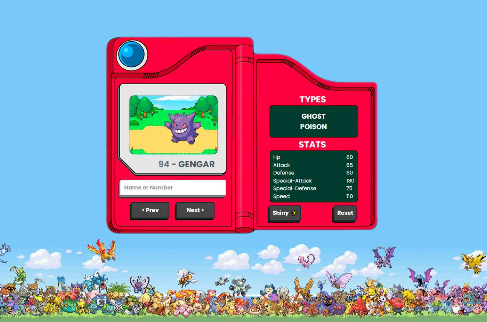

# 👨🏼‍🔬 Project to practice the Back-End with API.

  

# 👨🏻‍💻 Autor

- [Leonardo Carvalho](https://www.linkedin.com/in/leocarvalhodev/)

# 🚀 Technologies

- [React.js](https://reactjs.org/)
- [Vite.js](https://vitejs.dev/)
- [TypeScript](https://www.typescriptlang.org/)
- [TailwindCSS](https://tailwindcss.com/)
- [AXIOS](https://axios-http.com/ptbr/docs/intro)
- [React Icons](https://react-icons.github.io/react-icons/)
- [Eslint](https://eslint.org/)
- [Prettier](https://prettier.io/)

---

Made with 💜 &nbsp;by Leonardo Carvalho 👋 &nbsp;[See my linkedin](https://www.linkedin.com/in/leocarvalhodev/)
